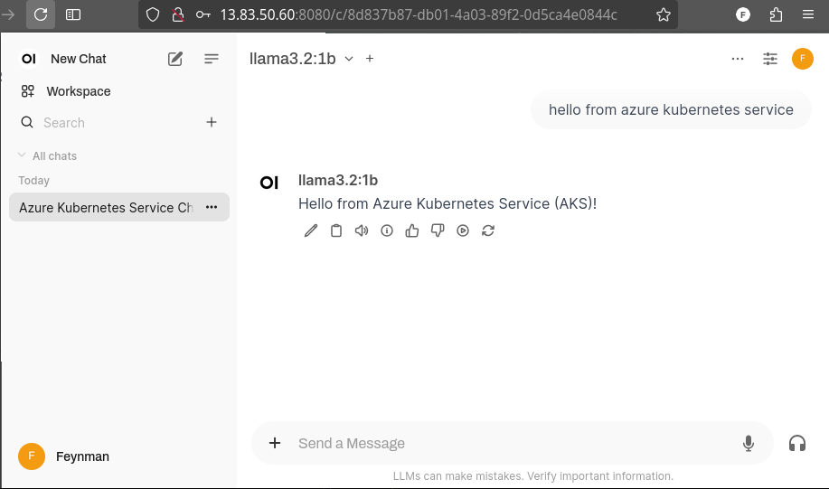

# Infrastructure as Code (IaC) for Ollama and Open WebUI on Azure Kubernetes Service (AKS)

## Infrastructure Provisioning

OpenTofu is used to provision the infrastructure.

```sh
az login
cd tofu/
tofu apply
```

## Obtaining Kubeconfig Credentials

```sh
cd tofu/
echo "$(tofu output kube_config)" > ../kubeconfig
```

## Deploying Ollama and OpenWebUI

```sh
kubectl apply -R -f k8s/
```

Note the external IP of the OpenWebUI service:

```sh
kubectl get svc openwebui
```

Access your OpenWebUI at `http://<EXTERNAL-IP>:8080`.


