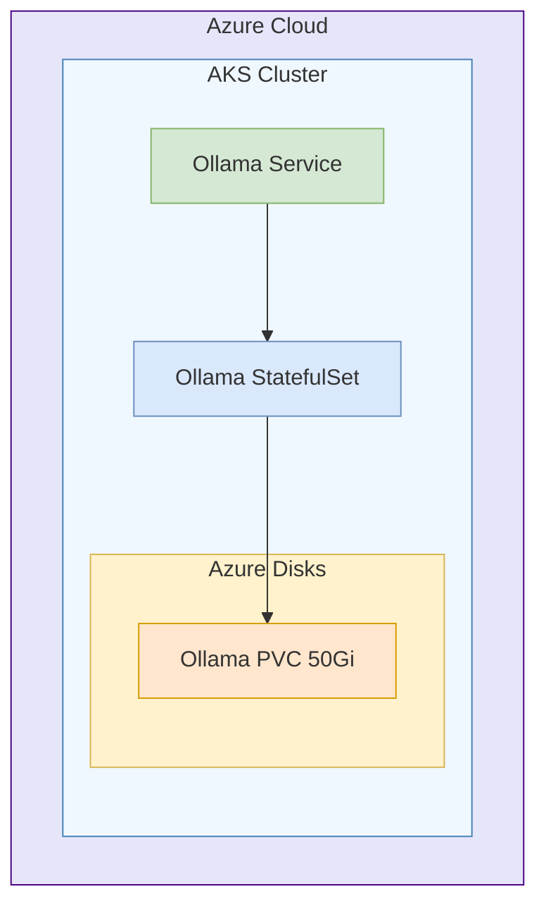

```mermaid
flowchart TD
    subgraph Azure["Azure Cloud"]
        subgraph AKS["AKS Cluster"]
            subgraph Storage["Azure Disks"]
                OPV["Ollama PVC 50Gi"]
            end
            
            OL["Ollama StatefulSet"]
            OS["Ollama Service"]
            
            %% Internal connections
            OS --> OL
            OL --> OPV

            direction TB
        end
    end
    

    %% Styling
    style Azure fill:#E6E6FA,stroke:#4B0082
    style AKS fill:#F0F8FF,stroke:#4682B4
    style Storage fill:#FFF2CC,stroke:#D6B656
    style OL fill:#DAE8FC,stroke:#6C8EBF
    style OS fill:#D5E8D4,stroke:#82B366
    style OPV fill:#FFE6CC,stroke:#D79B00

    %% Layout directions
    direction TB
```