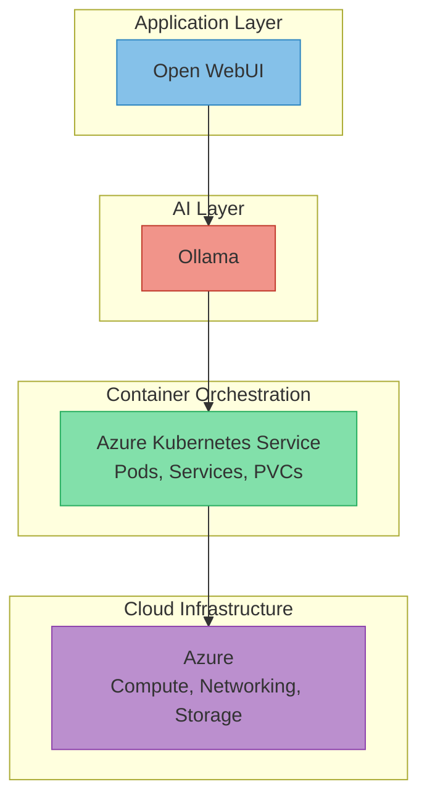

```mermaid
graph TD
    subgraph "Application Layer"
        W[Open WebUI]
    end
    
    subgraph "AI Layer"
        O[Ollama]
    end
    
    subgraph "Container Orchestration"
        K[Azure Kubernetes Service<br/>Pods, Services, PVCs]
    end
    
    subgraph "Cloud Infrastructure"
        A[Azure<br/>Compute, Networking, Storage]
    end

    W --> O
    O --> K
    K --> A

    style W fill:#85C1E9,stroke:#2E86C1
    style O fill:#F1948A,stroke:#C0392B
    style K fill:#82E0AA,stroke:#27AE60
    style A fill:#BB8FCE,stroke:#8E44AD
```