# Private AI Infrastucture on Azure
## A Practical Tutorial with Ollama & Open WebUI

Feynman Liang (feynman@blueteam.ai)

https://linkedin.com/in/feynman


---

# End Result


---

# Overview
 - Open Source AI
   - Open WebUI
   - Ollama
 - Declarative Infrastructure
   - OpenTofu
   - Kubernetes
 - Walkthrough



---

# Just show me the code

https://github.com/fmops/azure-private-ai-template


---

# Chat frontend with Open WebUI


<!-- ## Features
- Web interface for multiple LLM APIs
- Chat history
- Function calling
- Model management -->

---

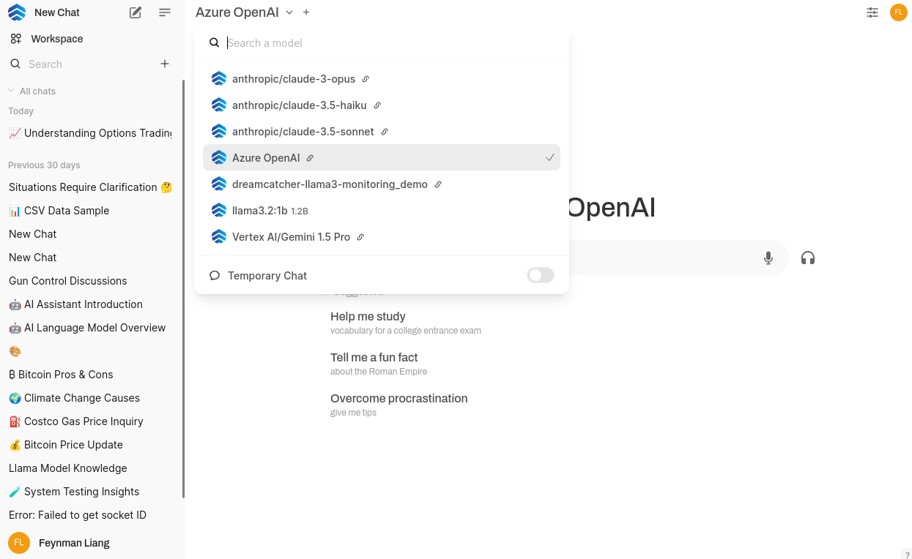

---

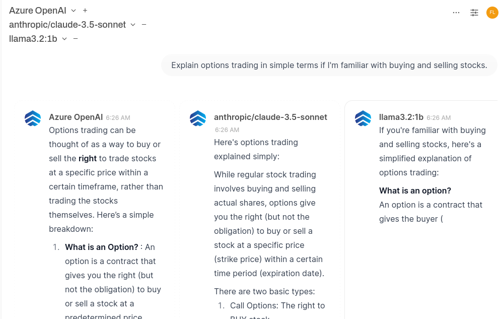

---

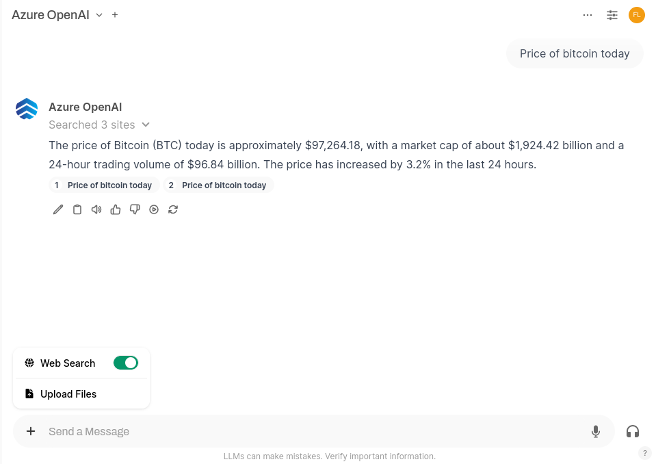

---

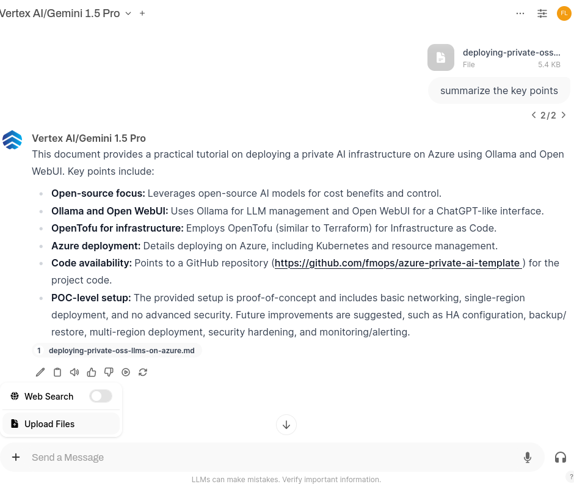

---

# Open Source LLMs with Ollama


---

# Why Open Source AI?

 - Cost Benefits
<!-- - No per-token or API charges
- Predictable infrastructure costs
- Scale with hardware, not usage -->

 - Freedom & Control
<!-- - No vendor lock-in
- Full model portability
- Data privacy by default
- Modify and fine-tune freely -->

 - Comparing to Closed Models
<!-- - Similar performance in many tasks
- Lower resource requirements
- Active community development -->

---

<!-- header: Image credits https://www.inspirisys.com/blog-details/Top-10-Open%CB%97Source-LLMs-of-2024-A-Complete-Guide/175 -->

# Open Source LLM Landscape

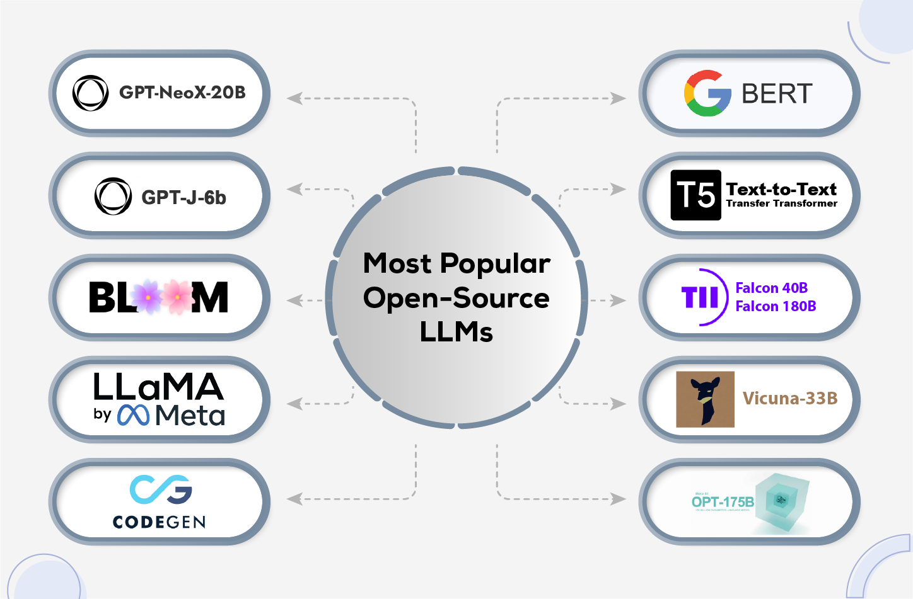

<!-- ## Key Open-Source Models
- Llama, CodeLlama, LlamaGuard
- Mistral, Mixtral
- Phi-3, Gemma 2 -->
<!-- - Llama 1: Meta's fully open source 7B-70B model family
- Mistral: Leading 6B model with strong performance
- CodeLlama: Specialized for code generation
- Phi-3: Microsoft's efficient small model -->

---

<!-- header: "" -->

# Ollama


<!-- ## What is Ollama?
- Model management & serving platform
- Easy model pulling and running
- Built-in quantization
- REST API for integrations -->

---

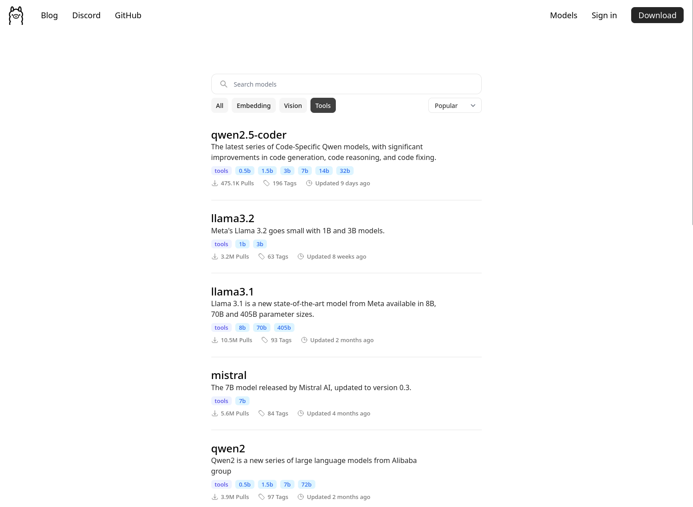

---
<!-- header: Image credits https://www.jeremymorgan.com/blog/generative-ai/ollama-windows/ -->

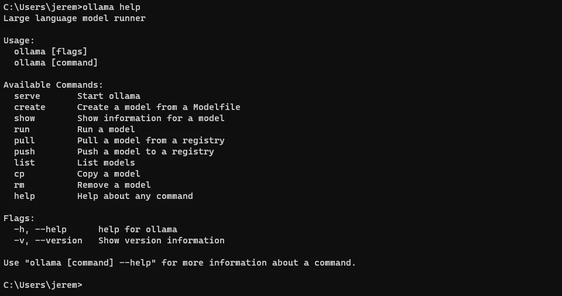

---

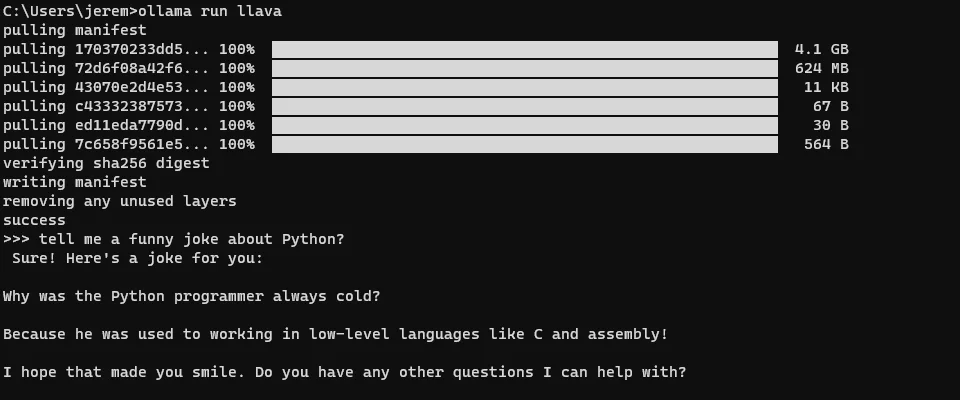

---

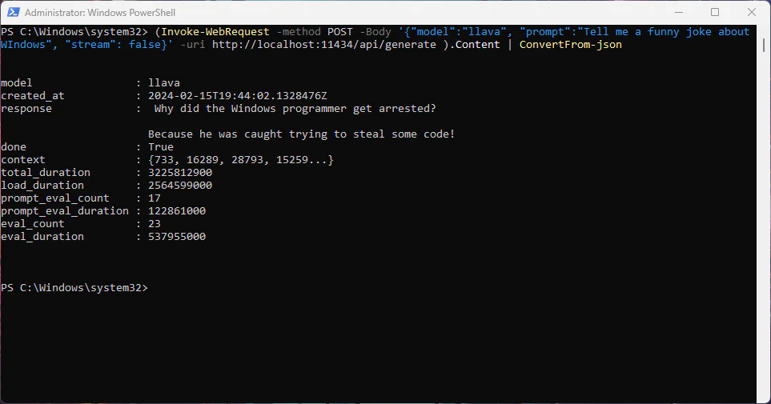

---

<!-- header: "" -->

# Declarative Infrastructure with OpenTofu and Kubernetes


 <!-- - Infrastructure as Code -->
<!-- - Infrastructure as code
- Provider ecosystem -->

 <!-- - OpenTofu vs Terraform -->
<!-- - Fork of Terraform (Nov 2022)
- Same HCL syntax and providers
- Fully open source -->

---

# Architecture Overview



---

```sh
resource "azurerm_resource_group" "rg" {
  location = var.resource_group_location
  ...
}

resource "azurerm_kubernetes_cluster" "k8s" {
  resource_group_name = azurerm_resource_group.rg.name

  default_node_pool {
    vm_size            = "Standard_D1_v2"
    node_count         = var.node_count
  }
  ...
}

```

---


```sh
❯ tofu apply

OpenTofu will perform the following actions:

  # azurerm_kubernetes_cluster.k7s will be created
  + resource "azurerm_kubernetes_cluster" "k7s" {
      + api_server_authorized_ip_ranges     = (known after apply)
      + current_kubernetes_version          = (known after apply)
      + dns_prefix                          = (known after apply)
      ...
    }

  # azurerm_resource_group.rg will be created
  + resource "azurerm_resource_group" "rg" {
      + id       = (known after apply)
      + location = "westus"
      + name     = (known after apply)
    }
    ...

Plan: 7 to add, 0 to change, 0 to destroy.
```

---


```yaml
apiVersion: apps/v1
kind: StatefulSet
spec:
  template:
    spec:
      containers:
      - name: ollama
        image: ollama/ollama:latest
        ports:
        - name: http
          containerPort: 11434
  volumeClaimTemplates:
  - spec:
      resources:
        requests:
          storage: 50Gi
---
apiVersion: v1
kind: Service
spec:
  ports:
  - port: 80
    targetPort: http
```

---


```yaml
apiVersion: apps/v1
kind: StatefulSet
spec:
  template:
    spec:
      containers:
      - name: open-webui
        image: ghcr.io/open-webui/open-webui:main
        env:
          - name: OLLAMA_BASE_URLS
            value: http://ollama:80
        ports:
        - name: http
          containerPort: 8080
  volumeClaimTemplates:
  - spec:
      resources:
        requests:
          storage: 1Gi
---
apiVersion: v1
kind: Service
spec:
  ports:
  - port: 8080
    targetPort: http
```

---

# Step by Step Walkthrough

---

## Infrastructure Setup
```bash
git clone https://github.com/fmops/azure-private-ai-template
cd tofu && tofu init && tofu apply
```

## Application Deployment
```bash
kubectl apply -f k8s/
```

## Done

---

# Just kidding...

## Day 2 Operations

- Logging: `kubectl logs`
- Monitoring: Azure Monitor
- Patching: `kubectl edit`
- Scaling: `kubectl scale`
- Disaster Recovery: VolumeSnapshots

---

# Thank you!

Questions?
